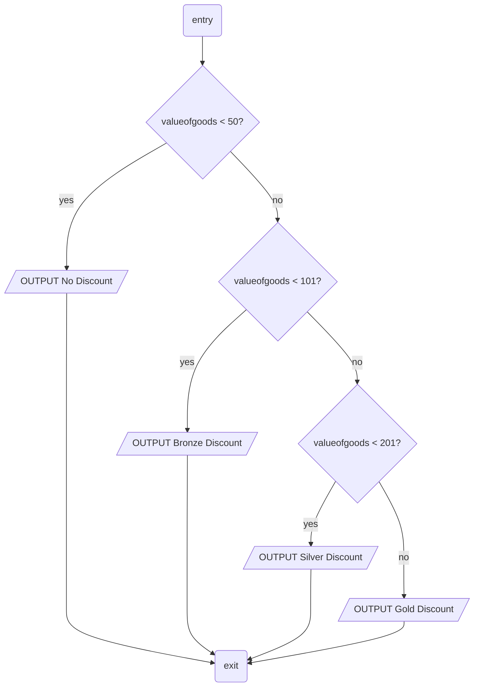

# Unit 01 Mock

> Fig 1

```Basic
REM Ensure subject is in age range 18-60
BEGIN
	REPEAT
		min = 18
		max = 60
		OUTPUT "What is your Age?"
		INPUT age
		IF age < min AND age > max THEN
			OUPUT "Error - age must be between 18 and 60"
		ELSE
			OUTPUT "Age verified"
		ENDIF
	UNTIL age >= min AND age < max
END
```

## Q1

There are two bugs in the algorithm of Fig 1 (if we assume the comment describes its purpose correctly). Identify them and suggest corrections. __4 marks__

## Q2

Draw a flowchart representing this algorithm using standard symbols __6 marks__


> Fig 2



## Q3

Study the flowchart of Fig 2 above. Write pseudocode to represent the same logic. __6 marks__

## Q4 

Complete the Python code below where the ellipsis (...) appears. The function `isValid` should return `True` if its parameter is an integer lying in the range 1 to 50 inclusive and `False` otherwise. __6 marks__

```python
def isValid(n):
	...
	...

	return True
```

## Q5

State clearly what the functional differences are between a list and a set. __4 marks__

A data structure is needed which must hold names and corresponding telephone numbers. Each name is associated with precisely one number and vice versa. Suggest with reasons a suitable data structure (there is more than one possible answer).  __6 marks__

## Q6 

List the four concepts/skills/steps of computational thinking and give a *simple* example of each. __8 marks__