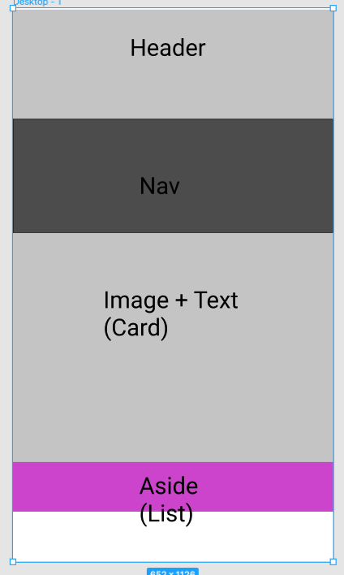
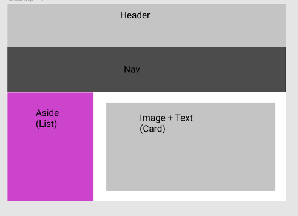

# Layout/Responsive Design Example

## Brief
On an xs/sm display we want the following elements
+ Header
+ Nav
+ Img + Text (eg, a card or similar)
+ List of links

Laid out vertically. 



Once the page is larger than sm we want the header and nav still to be full-width, stacked vertically but the list should now be on the left at roughly 1/4 of the page width with the main content on the right at roughly 3/4.




## Start with mobile

Blocks stack vertically by default and are full-width by default. So, that's easy.

```html
<header>
		<h1>
			Header
		</h1>
<header>

<nav>
		<div>
			Nav content
		</div>
<nav>

<div>
	Main content
</div>

<aside>
	<ul>
		List Content
	</ul>
</aside>
```
+ prefer `header `and `nav` and `aside` to more generic `div`s - it is what they are

for the desktop design though, we are goign to want to swap the order of the main and the aside and also have them horizontally and sized.

Let's prepare for that by putting these two elements in a row of a fluid container, but initially set to full width and existing order.

```html
<header>
		<h1>
			Header
		</h1>
</header>

<nav>
		<div>
			Nav content
		</div>
</nav>
<div class="container-fluid">
	<div class="row">

	<div class="col-12 order-1">
		Main content
	</div>

	<aside class="col-12 order-2">
		<ul>
			List Content
		</ul>
	</aside>

	</div>
</div>

```
This will indent the main and aside slightly as the container elements will have a gutter around them. If we do not want that we can adjust the gutters.

For the desktop version, we need to add some -md classess affecting the width and order of the main and aside.

```html
<header>
		<h1>
			Header
		</h1>
</header>

<nav>
		<div>
			Nav content
		</div>
</nav>
<div class="container-fluid">
	<div class="row">

	<div class="col-12 col-9-md order-1 order-2-md">
		Main content
	</div>

	<aside class="col-12 col-3-md order-2 order-1-md">
		<ul>
			List Content
		</ul>
	</aside>

	</div>
</div>

```
At  this point the elements are in the correct arrangement and order and we would need to start adding more realistic content and worrying about the sizing.

The header will be close. Let's add some color classes and see how it looks. We'll also center the text and add a little padding.

```html
...
<header class="bg-primary text-white p-2 text-center">
		<h1>
			Header
		</h1>
</header>
...

```
Note carefully where things are applied. The background and text colours are applied on the header so as to affect everything inside then.

No work wil be done on styling the nav element. We just paste in a standard bootstrap navbar to get a feel for how things look. Notice that this completely replaces the original nav element

```html
...
<nav class="navbar navbar-expand-lg navbar-light bg-light">
  <a class="navbar-brand" href="#">Navbar</a>
  <button class="navbar-toggler" type="button" data-toggle="collapse" data-target="#navbarTogglerDemo02" aria-controls="navbarTogglerDemo02" aria-expanded="false" aria-label="Toggle navigation">
    <span class="navbar-toggler-icon"></span>
  </button>

  <div class="collapse navbar-collapse" id="navbarTogglerDemo02">
    <ul class="navbar-nav mr-auto mt-2 mt-lg-0">
      <li class="nav-item active">
        <a class="nav-link" href="#">Home <span class="sr-only">(current)</span></a>
      </li>
      <li class="nav-item">
        <a class="nav-link" href="#">Link</a>
      </li>
      <li class="nav-item">
        <a class="nav-link disabled" href="#" tabindex="-1" aria-disabled="true">Disabled</a>
      </li>
    </ul>
    <form class="form-inline my-2 my-lg-0">
      <input class="form-control mr-sm-2" type="search" placeholder="Search">
      <button class="btn btn-outline-success my-2 my-sm-0" type="submit">Search</button>
    </form>
  </div>
</nav>

...
```
The one thing you will (probably) want to do is change the `navbar-expand-lg` to `navbar-expand-md` so that the bar is show expanded on the desktop display 

We've done a bit so let's have the full html to this point.

```html
<!DOCTYPE html>
<html>

<head>
    <meta charset='UTF-8'>
    <link rel='stylesheet' href='https://maxcdn.bootstrapcdn.com/bootstrap/4.1.3/css/bootstrap.min.css'>
    <link rel='stylesheet' href='styles.css'>
</head>

<body>

    <header class="bg-primary text-white p-2 text-center">

        <h1>Header</h1>

    </header>

    <nav class="navbar navbar-expand-md navbar-light bg-light">
        <a class="navbar-brand" href="#">Navbar</a>
        <button class="navbar-toggler" type="button" data-toggle="collapse" data-target="#navbarTogglerDemo02"
            aria-controls="navbarTogglerDemo02" aria-expanded="false" aria-label="Toggle navigation">
            <span class="navbar-toggler-icon"></span>
        </button>

        <div class="collapse navbar-collapse" id="navbarTogglerDemo02">
            <ul class="navbar-nav mr-auto mt-2 mt-lg-0">
                <li class="nav-item active">
                    <a class="nav-link" href="#">Home <span class="sr-only">(current)</span></a>
                </li>
                <li class="nav-item">
                    <a class="nav-link" href="#">Link</a>
                </li>
                <li class="nav-item">
                    <a class="nav-link disabled" href="#" tabindex="-1" aria-disabled="true">Disabled</a>
                </li>
            </ul>
            <form class="form-inline my-2 my-lg-0">
                <input class="form-control mr-sm-2" type="search" placeholder="Search">
                <button class="btn btn-outline-success my-2 my-sm-0" type="submit">Search</button>
            </form>
        </div>
    </nav>

    <div class="container-fluid">
        <div class="row">

            <div class="col-12 col-md-9 order-1 order-md-2">
                Main content
            </div>

            <aside class="col-12 col-md-3 order-2 order-md-1">
                <ul>
                    List Content?
                </ul>
            </aside>

        </div>
    </div>

    <script src='https://code.jquery.com/jquery-3.3.1.slim.min.js'></script>
    <script src='https://cdnjs.cloudflare.com/ajax/libs/popper.js/1.14.3/umd/popper.min.js'></script>
    <script src='https://stackpath.bootstrapcdn.com/bootstrap/4.1.3/js/bootstrap.min.js'></script>
</body>

</html>

```
Next the aside list. This is going to be purely dummy content, so let's take a Bootstrap List Group.

```html
...
<aside class="col-12 col-md-3 order-2 order-md-1">
	<ul class="list-group">
	<li class="list-group-item active">Cras justo odio</li>
	<li class="list-group-item">Dapibus ac facilisis in</li>
	<li class="list-group-item">Morbi leo risus</li>
	<li class="list-group-item">Porta ac consectetur ac</li>
	<li class="list-group-item">Vestibulum at eros</li>
	</ul>
</aside>
...
```
