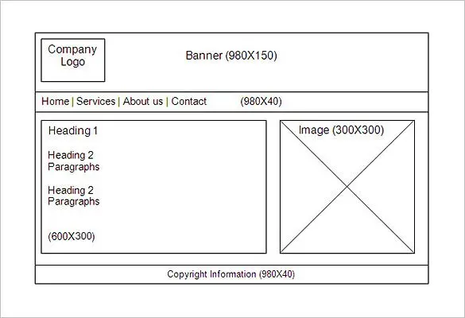

# Storyboards (for Web pages)

A storyboard is a graphical presentation of your concept. For an app it may actually be like a comic strip as it needs to show interaction, but for web design a storyboard is usually an image.

Storyboards have two main uses

1. Sharing with clients to explain the concepts of how the site is going to work. In this use first impressions can be important and some designers will go to the extent of a full, glossy, mockup of how the site will look made in PhotoShop or similar. This has the advanatage that some of the actual colours, typography and image content can be seen, but is quite a lot of work. Hint. Probably overkill.

2. Sharing with the coder, the implementors, to make sure that all their questions about what they are making are answered. The emphasis here is on sizes; layout; what colours, where; what fonts, where. This type is much more like a diagram.
  
   An example of this type is shown below. This is not sufficient, but it does give an indication of what is expected. Some of the flaws are:-
   + There is no guidance as to how big the spaces are (and how big is the logo?).
   + We would also need to add as an overlay or via a key, guidance as to what colours are used where and which fonts (and font sizes) in each section.

   
